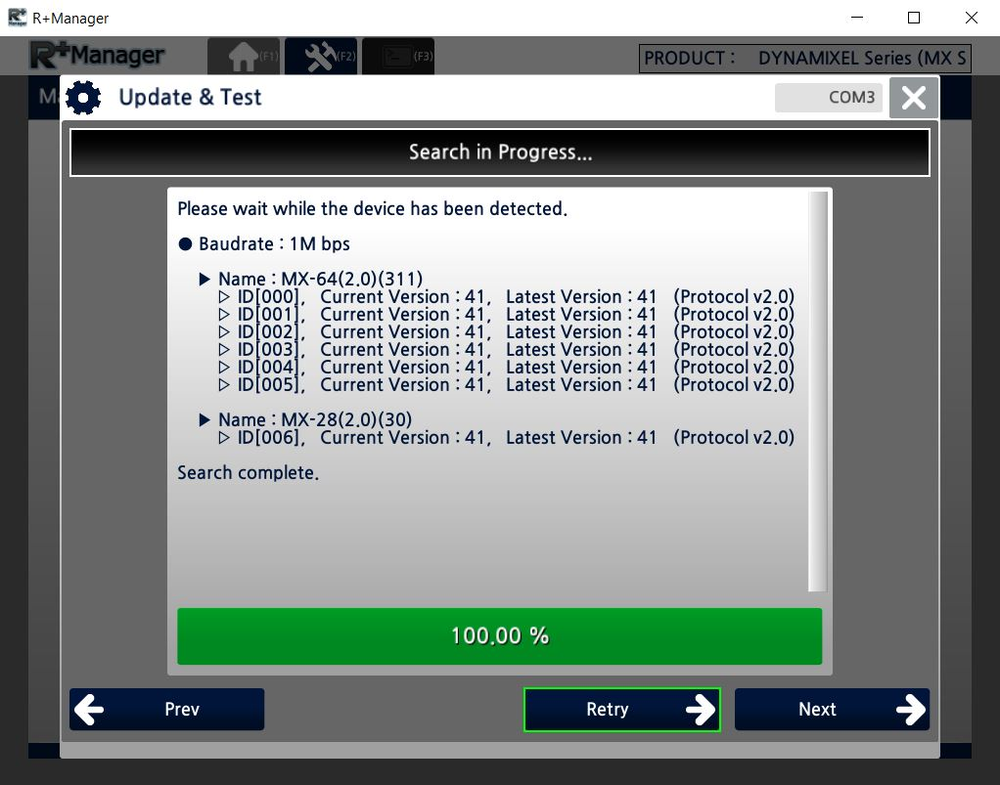

# CrustCrawler Hardware
This repository contains ROS code for connecting with the real CrustCrawler
hardware.

## Install
First clone or copy this repository into your [workspace][1] `src`.

```bash
$ cd /path/to/workspace/src
$ git clone https://github.uio.no/INF3480/crustcrawler_hardware.git
```

Then clone [DynamixelSDK][2] into `src`

```bash
$ cd /path/to/workspace/src
$ git clone --branch 3.7.0 https://github.com/ROBOTIS-GIT/DynamixelSDK.git
```

## Build
After installing the repository and dependencies (make sure all ROS dependencies
have been [resolved][3]), build as usual.

```bash
# Or `catkin build`
$ catkin_make
```

## Usage
Use the launch file `control.launch` to run the necessary ROS nodes. The main
configurations for the launch file are `control` and `full_arm`. The first
selects the controller manager to utilize, available are [`trajectory`,
`position`, `velocity`, `effort`], and the later controls how many joints are
connected to the arm, `full_arm:=true` when all joints are connected and
`full_arm:=false` when the marker is connected.

### Enable
After successful launch one has to enable the arm as torque is _not_ enabled when
the code is run.

The following will **enable** the arm (commands will now be executed) and torque is
applied.
```bash
$ rostopic pub -1 /crustcrawler/enable std_msgs/Bool true
```

To **disable** torque run (be careful the arm will fall):
```bash
$ rostopic pub -1 /crustcrawler/enable std_msgs/Bool false
```
** Shutting down the node will also disable torque! **

### Controllers
To be a good ROS citizen this package uses [`ros_control`][4](and
[`ros_controllers`][5]) for command controls. The respective controllers and
their capabilities are documented elsewhere, but for most users the
[`joint_trajectory_controller`][6] should be the first place to look.

### Examples
Useful for using the pen and MoveIt:
```bash
$ roslaunch crustcrawler_hardware control.launch full_arm:=false
control:=trajectory
```

Useful with the full arm and custom effort controls:
```bash
$ roslaunch crustcrawler_hardware control.launch full_arm:=true control:=effort
```

[1]: http://wiki.ros.org/catkin/Tutorials/create_a_workspace
[2]: https://github.com/ROBOTIS-GIT/DynamixelSDK/
[3]: http://wiki.ros.org/ROS/Tutorials/rosdep
[4]: http://wiki.ros.org/ros_control
[5]: http://wiki.ros.org/ros_controllers
[6]: http://wiki.ros.org/joint_trajectory_controller?distro=lunar

### Troubleshooting and updates

This will be especially relevant if you are making the 6DOF version.

These are all troubleshooting experiences when working on this hardware repo with Ubuntu 18.04, but will probably be applicable to other setups aswell.

Before you start doing anything, make sure all servos are protocol 2.0 (and not 1.0):
- Download [R+ Manager 2.0](http://www.robotis.us/roboplus2/)
- Open it and go to `Update & Test` and check one and one of the servos.
- If there is servos that are 1.0, connect them one at a time and update the firmware by going into `Firmware Recovery`, __not__ `Update & Test`!
- Follow the steps and take in and out the 3 pin TTL connector from the servo when you'r asked to disconnect the servo.

Remember to update the Baudrate, ID and other settings (that you have changed) after the protocol update, because all these will be reset.

You are now set for connecting all servos together and try out the hardware.

When connecting to the fully assembled robot, you may get this usb error:

```
[PortHandlerLinux::SetupPort] Error opening serial port!
```

Then run:

```
sudo chown yourUserName /dev/ttyUSB0
```
Assuming your `USB` is connected at `ttyUSB0`.

Further, you may get this error:

```
[ INFO] [1532011582.824068948]: Crustcrawler hardware initialized
Error reading from servos, error: -3001
Error reading from servos, error: -3001
Error reading from servos, error: -3001
Error reading from servo: 4, error: -3001
Error reading from servo: 5, error: -3001
Error reading from servo: 6, error: -3001
```

which is a [communication error](https://github.com/ROBOTIS-GIT/DynamixelSDK/blob/master/c%2B%2B/include/dynamixel_sdk/packet_handler.h#L59).

The first fast thing to check is that the latency may be to high. Set it to 1 (it's originally 16) by running

```
echo 1 | sudo tee /sys/bus/usb-serial/devices/ttyUSB0/latency_timer
```

and then yo can see that

```
cat /sys/bus/usb-serial/devices/ttyUSB0/latency_timer
```
gives you `1`. Also `dmesg` can be useful to check the connection status of the `USB`.

If none of this helps and the `3001` error still is making your head hurt, there is probably a bad connection or a faulty/broken wire somewhere.

1. Check that all the wires male plugs are connected appropriatly.
2. Open [R+ Manager](http://emanual.robotis.com/docs/en/software/rplus2/manager/#introduction) and go into Update & Test. Test the whole connection by having all servos connected. You should see an image like this:
<div align="center">
   <br>
  <br><br>
</div>

   if not, connect one and one (or two and two) servos and set correct
  - ID
  - Baudrate
3. If all ID's and Baudrates are correct, and you are still not getting up the whole chain of all the servos (like over), try to disconnect one and one of the servos, starting with the last. Hopefully you will get a chain of at least two servos. Try to get as long a chain of connected servos as possible. In this way you can isolate the faulty cable.

Good luck!


Feel free to check out the documentation on [MX-64](http://support.robotis.com/en/product/actuator/dynamixel/mx_series/mx-28%282.0%29.htm) and [MX-28](http://support.robotis.com/en/product/actuator/dynamixel/mx_series/mx-28%282.0%29.htm) for any adresses, values and system requirements.
